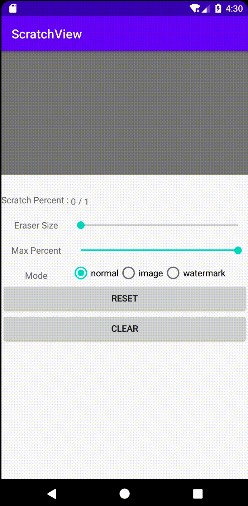

# ScratchView
刮刮卡效果的自定义View
## 效果


## 用法
Step 1. Add the JitPack repository to your build file
Add it in your root build.gradle at the end of repositories:
```
allprojects {
    repositories {
        ...
        maven { url 'https://jitpack.io' }
    }
}
```
Step 2. Add the dependency
```
dependencies {
    implementation 'com.github.MaxPanda0206:ScratchView:1.0.1'
}
```
XML
```
<androidx.constraintlayout.widget.ConstraintLayout
        android:layout_width="match_parent"
        android:layout_height="match_parent">
        <!-- 底部 -->
        <TextView
            android:id="@+id/content_view"
            android:layout_width="match_parent"
            android:layout_height="0dp"
            android:gravity="center"
            android:text="谢谢惠顾"
            android:textColor="@color/colorAccent"
            android:textSize="40sp"
            android:textStyle="bold"
            app:layout_constraintDimensionRatio="H,2:1"
            app:layout_constraintTop_toTopOf="parent"
            tools:ignore="HardcodedText" />
        <!-- 表面 -->
        <cn.com.maxpanda.view.ScratchView
            android:id="@+id/scratch_view"
            android:layout_width="match_parent"
            android:layout_height="0dp"
            app:surfaceDrawMode="normal"
            app:surfaceColor="@color/colorPrimary"
            app:surfaceImageSrc="@mipmap/scratch_bg"
            app:eraseSize="60"
            app:layout_constraintDimensionRatio="H,2:1"
            app:layout_constraintTop_toTopOf="parent">

        </cn.com.maxpanda.view.ScratchView>
    </androidx.constraintlayout.widget.ConstraintLayout>
```
JAVA

```
ScratchView scratchView = new ScratchView(this);
scratchView.setMaxPercent(0.8f); // 0f ～ 1f
scratchView.setEraseSize(60f);
scratchView.setSurfaceImageSrcId(R.mipmap.scratch_bg);
scratchView.setSurfaceDrawMode(ScratchView.Mode.WATERMARK);// ScratchView.Mode.NORMAL | ScratchView.Mode.WATERMARK
scratchView.setSurfaceColor(Color.RED);
scratchView.setOnEraseStatusListener(new ScratchView.OnEraseStatusListener() {
    @Override
    public void onProgress(float percent) {
        
    }

    @Override
    public void onCompleted(View view) {

    }
});
```
